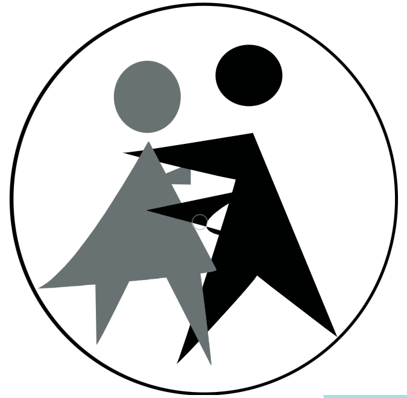
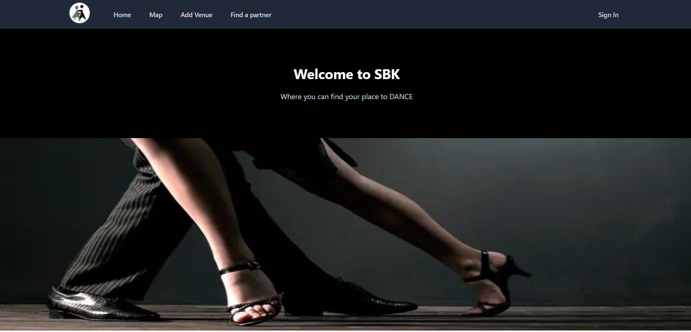
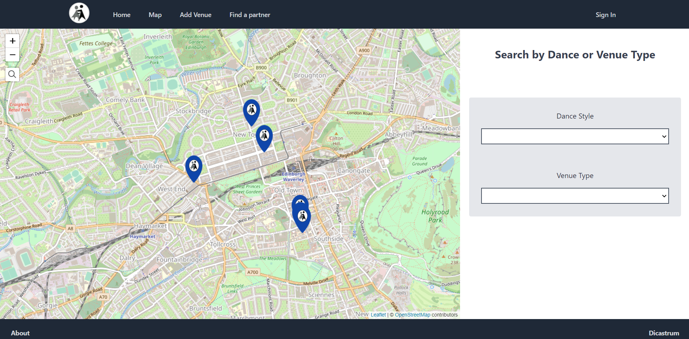

# SBK (Salsa, Bachata, Kizomba)

<p align="center">
  
</p>


SBK is a website for dancers find venues were to learn/practice/dance.

1. Map search for venues with filter for the dances styles and what is looking for.
2. Users can add new venues to inform fellow dancers of venues that are not listed yet.


## Screenshots

<p align="center">
  
  
</p>


## Getting started

1. Clone the repo

```
git clone https://github.com/DiCastrum/SBK
cd SBK
```

2. Install dependencies
```
npm install
```

3. Start development server
```
npm run dev
```


## Built with

* [Next.js](https://nextjs.org/) - The React Framework for Production
* [Tailwind](https://tailwindcss.com/) - CSS framwork
* [React-Leaflet](https://react-leaflet.js.org/) - Open source maps
* [NextAuth](https://next-auth.js.org/) - Authentication for Next.js
* [Prisma](https://www.prisma.io/) - Next-generation Node.js and TypeScript ORM
* [PostgreSQL](https://www.postgresql.org/) - The World's Most Advanced Open Source Relational Database
* Some API keys/password are needed, .env already setup, only need to type your keys


## Author

Pedro de Castro - [Github](https://github.com/DiCastrum) - [LinkedIn](www.linkedin.com/in/pedro-de-castro-dicastrum)
